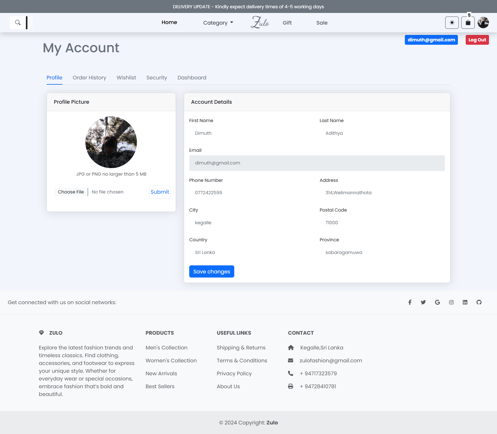
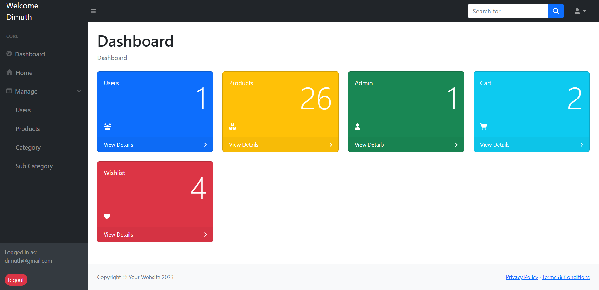
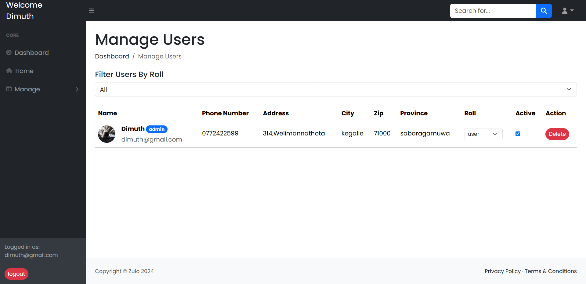

# Zulo E-commerce Website

Zulo is an e-commerce website built with PHP, HTML, CSS, and JavaScript. The website allows users to browse products, add them to their cart, and checkout. It also includes features such as user authentication, wishlist, and order history.

## Features

- User authentication
- Wishlist
- Order history
- Search products
- Add to cart
- Checkout

## Technologies Used

- PHP
- HTML
- CSS
- JavaScript
- Bootstrap
- Font Awesome

## How to Run

1. Clone the repository
2. Set up a local web server
3. Open the website in a web browser

## Screenshots

